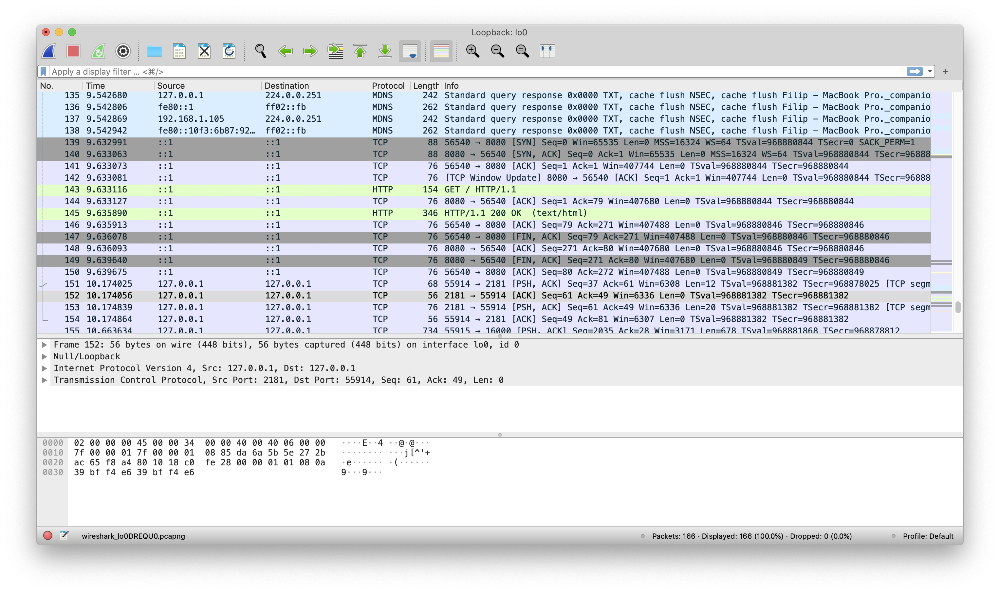
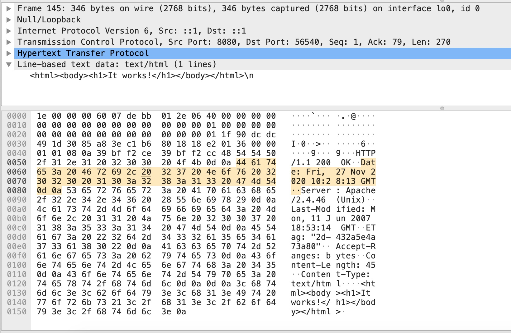
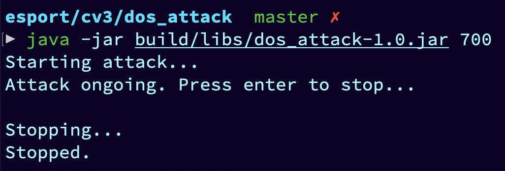
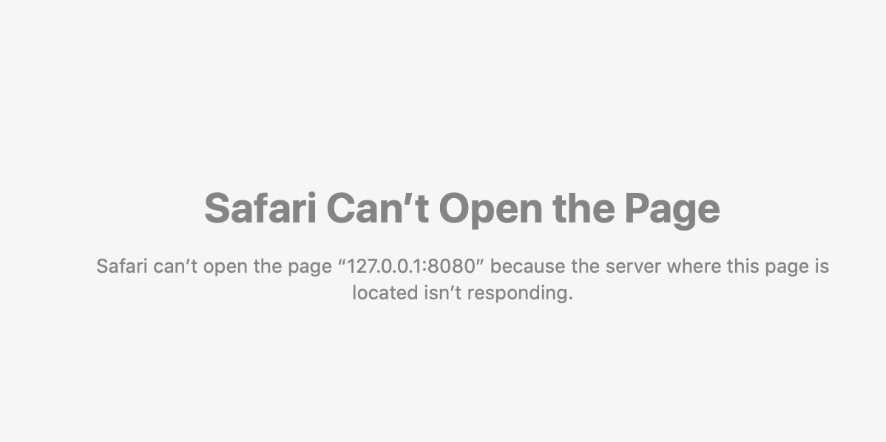
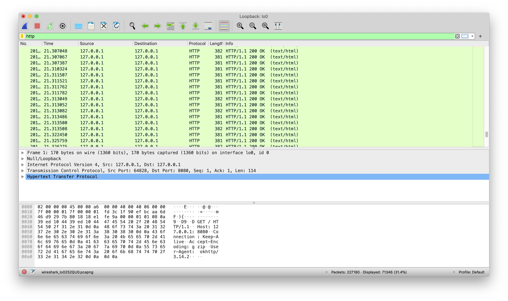

# DOS Útok

Při provádění simulovaného DOS útoku je třeba nejprve spustit webový server, na který chceme 'útok' provést.

```bash
docker run -it --name apache-server -p 8080:80 httpd:2.4
```

Funkčnost serveru můžeme ověřit jednoduchým HTTP GET requestem poslaným pomocí `curl` nebo `wget`.

```bash
curl 127.0.0.1:8080
```

Curl request lze samozřejmě zachytit pomocí Wiresharku.





Samotný DOS útok poté provedeme pomocí jednoduchého programu, který bude neustále, ideálně na více threadech, tvořit nová spojení se serverem. Spojení je ideální nezavírat, aby si napadený server musel držet co nejvíce otevřených spojení současně. Program spustíme a sledujeme traffic na loopbacku pomocí Wiresharku. 



Dále se můžeme pokusit připojit na server sami, např. pomocí browseru nebo `wget`. 



Server však neodpovídá. Pokud program při útoku neuzavírá HTTP spojení, stačí traffic z jednoho threadu na to, aby server v defaultní konfiguraci po pár sekundách přestal odpovídat. Ve Wiresharku můžeme sledovat traffic během útoku.



Apache server není asynchronní, nedokáže tedy zpracovávat více spojení na jednom threadu. Proto je zpracování náročné na CPU (při normálním zpracování HTTP requestů není CPU příliš využité, protože takové je zpracování requestů často IO-bound, proto se dnes využívá asynchronní zpracování na jednom threadu, problém představuje spíše orchestrace velkého množství threadů) i na RAM (musí se spawnovat thread pro každé spojení). Každé spojení také vyžaduje vlastní File Descriptor, velké využití File Descriptorů může také teoreticky představovat problém.

